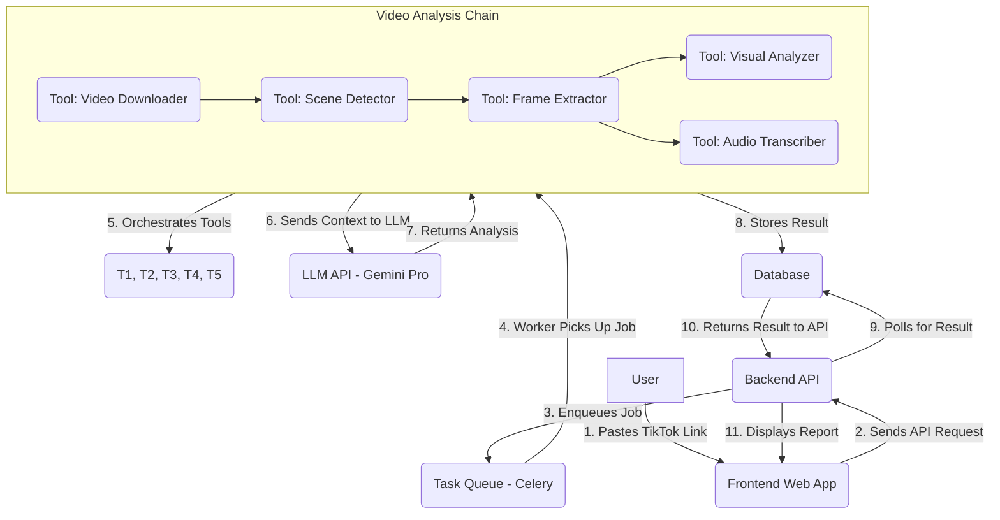

# TikTok Video Analyzer Agent: MVP Design

## 1. Product Vision
To create an intelligent agent that provides deep insights into TikTok videos, helping creators, marketers, and researchers understand video performance, trends, and audience engagement.

## 2. Core Features (MVP)

*   **Video Link Input:** A simple interface (web UI or CLI) to accept a public TikTok video URL.
*   **Video Downloader:** A backend service to download the video from the provided link.
*   **Information Extractor:**
    *   **Visual Analysis:** Extracts keyframes using scene detection (e.g., using `PySceneDetect` to split the video into scenes and then taking the middle frame of each scene). This avoids redundant frames and captures the most representative moments. It then identifies objects, scenes, and text (OCR) from these keyframes.
    *   **Audio Analysis:** Transcribes speech to text.
*   **LLM-Powered Analysis & Report Generation:** The agent sends the extracted visual and audio data (scene-by-scene frames, full transcript, object/text recognition data) to the LLM to generate a comprehensive report. The final report will be presented in a clean, easy-to-read format and will include:
    *   **1. Full Speech Transcript:** The complete, time-stamped transcription of the video's audio.
    *   **2. Reverse-Engineered Storyboard & Script:**
        *   **Storyboard:** A visual representation of key scenes with descriptions of the action, camera angles, and on-screen text for each.
        *   **Shooting Script:** A structured script format detailing scenes, dialogue, and visual cues, as if it were written before production.
    *   **3. In-Depth Analysis:**
        *   **Hook Analysis:** Evaluation of the first 3 seconds and its effectiveness in capturing attention.
        *   **Pacing & Editing:** Comments on the video's rhythm, transitions, and editing style.
        *   **Call-to-Action (CTA) Effectiveness:** Assessment of any explicit or implicit CTAs.
        *   **Potential for Virality:** An overall score or assessment of the video's potential to go viral, based on identified trends, emotional triggers, and engagement tactics.
        *   **Audience Persona:** A description of the likely target audience for the video.

## 3. Target Audience

*   **Content Creators:** To optimize their video strategy and increase engagement.
*   **Digital Marketers:** To analyze competitor content and identify viral trends.
*   **Social Media Researchers:** To study online culture and communication patterns.

## 4. Frontend Design (React)

*   **Core Components:**
    *   `App.js`: The main component that manages the overall state.
    *   `VideoInput.js`: A simple form with a text field for the TikTok URL and a submit button.
    *   `StatusDisplay.js`: A component to show the current status of the analysis (e.g., "Downloading video...", "Analyzing frames...", "Generating report..."). It will poll the backend for status updates.
    *   `ResultsDisplay.js`: Once the analysis is complete, this component will fetch the report content from the backend, parse the markdown, and display it directly on the page. It will also provide links to download the raw `.mp4` video and the `.md` report.
*   **User Flow & State Management:**
    1.  The user pastes a TikTok URL into the `VideoInput` component and clicks "Analyze".
    2.  The `App` component sends a `POST` request to the backend's `/analyze` endpoint.
    3.  The backend returns a unique `job_id`. This `job_id` is stored in the `App` component's state.
    4.  The `StatusDisplay` component begins polling the backend's `/status/{job_id}` endpoint every few seconds.
    5.  When the status is "complete", the `App` component fetches the result details from `/results/{job_id}`.
    6.  The `ResultsDisplay` component fetches the analysis content from `/results/{job_id}/content`, renders the report on the page, and displays download links for the source video and the markdown report.

## 5. Backend Design (FastAPI)

*   **API Endpoints:**
    *   `POST /analyze`: 
        *   Accepts a JSON body: `{"url": "<tiktok_url>"}`.
        *   Creates a unique `job_id` (e.g., using `uuid.uuid4()`).
        *   Creates a temporary directory on the server named after the `job_id` to store artifacts.
        *   Starts the LangChain analysis agent as a background task (using FastAPI's `BackgroundTasks` or Celery).
        *   Returns `{"job_id": "<job_id>"}` immediately.
    *   `GET /status/{job_id}`:
        *   Checks the state of the job (e.g., by checking for the existence of certain files in the job's directory like `video.mp4`, `report.md`, or a `status.txt` file).
        *   Returns `{"status": "<current_status>"}`.
    *   `GET /results/{job_id}/content`:
        *   Reads the generated `report.md` file from the job's directory.
        *   Returns the content as a JSON response: `{"report_content": "<markdown_string>"}`.
    *   `GET /download/{job_id}/{file_type}`:
        *   `file_type` will be either `video` or `report`.
        *   Serves the corresponding file (`video.mp4` or `report.md`) from the job's temporary directory using FastAPI's `FileResponse`.
    *   `GET /download/{job_id}/{file_type}`:
        *   `file_type` will be either `video` or `report`.
        *   Serves the corresponding file (`video.mp4` or `report.md`) from the job's temporary directory using FastAPI's `FileResponse`.

*   **No Database & Cleanup Policy:** For the MVP, the file system will act as our temporary database. Each analysis job gets its own folder, and the presence of files within that folder dictates the job's status and provides the assets for download. For a production environment, a cleanup mechanism would be implemented to automatically delete the oldest job directories, ensuring only the 10 most recent results are retained.

## 6. Tech Stack (Proposed)

*   **Frontend (Product Form):** A simple web application.
    *   **Framework:** React (using Create React App or Vite for simplicity).
    *   **Styling:** Tailwind CSS for rapid, utility-first UI development.
*   **Backend:**
    *   **Language:** Python - ideal for ML/AI and data processing tasks.
    *   **Framework:** FastAPI for building the high-performance, asynchronous API.
    *   **Video Downloading:** `yt-dlp` (a fork of youtube-dl with more features and better support for TikTok).
    *   **Visual Analysis:** OpenCV for frame extraction, a pre-trained model for object detection (e.g., YOLO), and an OCR library (e.g., `pytesseract`).
    *   **Audio Analysis:** `ffmpeg` for audio extraction, and an ASR (Automatic Speech Recognition) model like OpenAI's Whisper.
    *   **Agent Framework:** LangChain to structure the agent's workflow. LangChain will be used to create chains that sequence the steps: video downloading, visual analysis, audio analysis, and final report generation using the LLM.
*   **LLM Integration:** Google Gemini Pro API. The agent will use LangChain's integrations to interact with the Gemini API, sending the structured data (transcripts, scene descriptions, OCR text) for analysis.
*   **Infrastructure:**
    *   **Deployment:** Docker for containerization, deployed on a cloud service like Vercel (for the frontend) and AWS/Google Cloud/Heroku (for the backend).
    *   **Task Queue:** Celery with Redis/RabbitMQ to handle long-running tasks like video downloading and analysis asynchronously.

## 7. System Architecture & User Flow

## 8. MVP Limitations & Future Work

*   **MVP is not real-time:** Analysis is asynchronous.
*   **Limited to public videos:** No support for private or restricted content.
*   **Basic analysis:** Does not include trend analysis across multiple videos or user profile analysis.
*   **Future:** Real-time analysis, batch processing, historical trend tracking, and integration with other social media platforms.